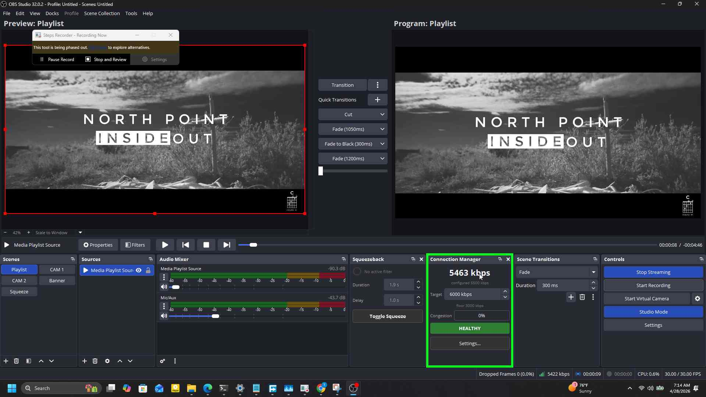
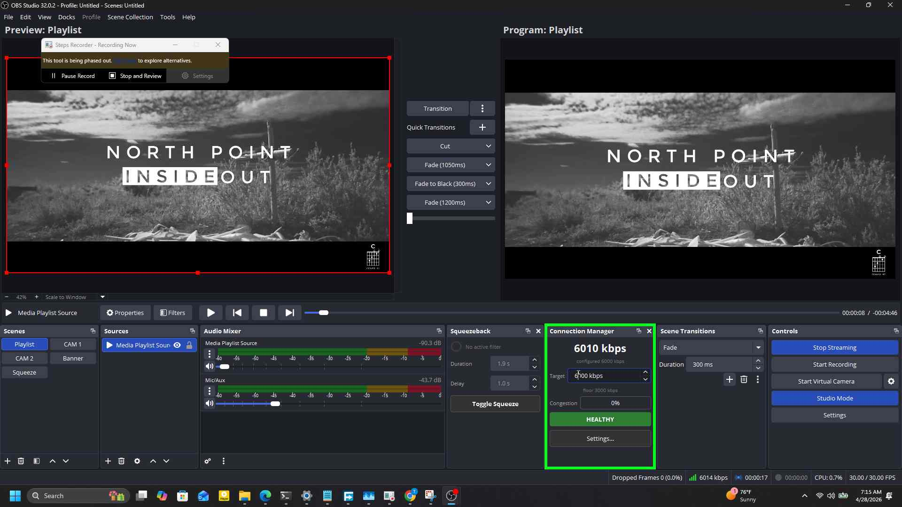
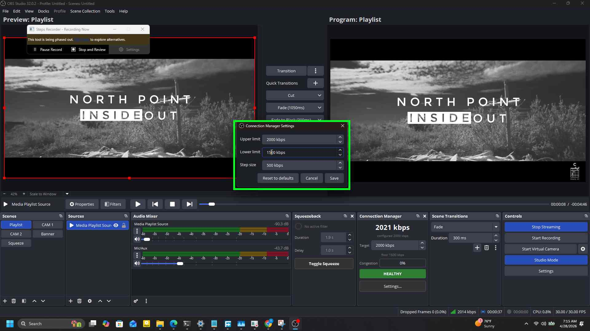

# OBS Connection Manager

Adaptive bitrate manager for OBS Studio. Companion to [obs-squeezeback](https://github.com/Tamunorth/obs-squeezeback).

[](https://github.com/Tamunorth/obs-connection-manager/releases/latest)
[](LICENSE)

## What it does

Watches your upload network during a live stream and adjusts the encoder bitrate to keep the stream alive when bandwidth degrades. A dock panel shows live throughput, the configured bitrate, the current floor, and a congestion bar, with a target field you can edit mid-stream without opening any settings dialog. When the stream is genuinely breaking, a red banner appears in the dock and a Windows toast fires once. Every adjustment is written to a per-stream session log. While active, the plugin disables OBS's built-in dynamic bitrate control to avoid two systems fighting over the encoder, then restores it when the stream stops.



## Why this exists

OBS ships a built-in "Dynamically change bitrate to manage congestion (Beta)" checkbox. It works, but it's a single toggle with no thresholds, no operator feedback, and no record of what it did. This plugin gives you the controls and the visibility.

| Feature | OBS DBR | Connection Manager |
| --- | --- | --- |
| Configurable thresholds | No | Yes (upper, lower, step size) |
| Step size | Hardcoded | Configurable, default 1000 kbps |
| Operator alert when stream breaks | No | Red dock banner plus Windows toast |
| Live editable target | No | Yes, spinbox in the dock |

## Install

1. Download the installer from the [latest release](https://github.com/Tamunorth/obs-connection-manager/releases/latest).
2. Run it. The installer auto-detects your OBS install directory and copies the DLL into place. Restart OBS.

## Usage

The dock lives under View, Docks, Connection Manager. Drag it anywhere in your OBS layout.

The dock shows live throughput in kbps (sampled over a 1-second window, the same way the OBS status bar does it), the encoder's currently configured kbps, an editable target spinbox, the current floor, a congestion bar, and a state badge that reflects the monitor's view of the network.

You can change the target live. Type a new value into the spinbox or use the arrows; the plugin saves it immediately and the next monitor tick uses it as the new ceiling. No need to stop the stream or open settings.



For a longer walkthrough including setup screenshots and a recovery demo, see the [Connection Manager guide](https://vies-live.netlify.app/blog/obs-connection-manager-guide).

## Settings reference

Open via Tools, Connection Manager Settings, or the Settings button in the dock.

| Setting | Default | Range | Description |
| --- | --- | --- | --- |
| Upper limit | 6000 kbps | 500 to 50000 | The ceiling. The manager never pushes the encoder above this value. |
| Lower limit | 1500 kbps | 100 to 50000 | The hard floor. The manager won't drop below this even if the network keeps degrading. |
| Step size | 1000 kbps | 50 to 10000 | How much each step adds or removes per adjustment. |

The lower limit is clamped to the upper limit on save, so you can't accidentally invert them.



## How it decides

A monitor thread polls roughly every 300 ms while a stream is active. It reads OBS's congestion value (the same signal that drives the red indicator on the streaming status icon) and walks a small state machine:

- **HEALTHY**: congestion is below 0.50. If the encoder is currently below the target, the manager waits 5 seconds (the recovery window) of sustained healthy state, then steps the bitrate up by the step size.
- **DEGRADING**: congestion is at or above 0.50 and the encoder is still above the floor. The manager steps the bitrate down by the step size, no faster than once per second.
- **AT_FLOOR**: the encoder has reached the floor and congestion is still high. No further step-downs are possible; the manager holds.
- **BREAKING**: congestion is at or above 0.95 and the encoder is at the floor for at least 5 seconds (the breaking hold). At this point the dock banner appears and the Windows toast fires once.

The floor is computed as half the configured target, but never lower than the configured lower limit and never lower than 100 kbps.

## Hotkeys

Three hotkeys are registered for development and testing. They're unbound by default. Set bindings under Settings, Hotkeys, search "Connection Manager".

| ID | Action |
| --- | --- |
| cm.force_congestion_red | Connection Manager: Force congestion red (dev/test) |
| cm.force_congestion_clear | Connection Manager: Clear forced congestion (dev/test) |
| cm.run_selftest | Connection Manager: Run self-test (dev/test) |

The self-test runs a scripted congestion curve against a synthetic 6000 kbps target, so you can see the dock badge cycle through HEALTHY, DEGRADING, AT_FLOOR, BREAKING, and back without needing a real stream.

## Build from source

Prerequisites:

- Visual Studio Build Tools 2022 with the C++ workload
- CMake 3.16 or newer
- Qt6 6.7.0 at C:\Qt\6.7.0\msvc2019_64
- Inno Setup 6 (for the installer step)
- OBS Studio installed (CMake auto-detects the install directory)

Then from the repo root:

```bash
build_release.bat
```

This produces the plugin DLL under build\Release\ and the installer at dist\obs-connection-manager-<version>-setup.exe.

## Roadmap

Planned work and open questions live in [ROADMAP.md](ROADMAP.md).

## License

GPL-2.0 (same as OBS Studio).
